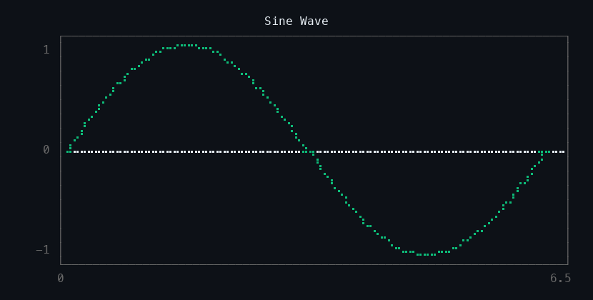
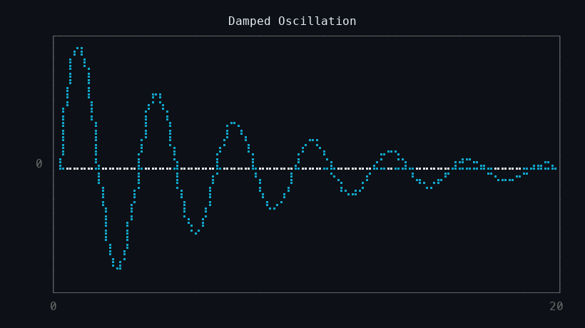
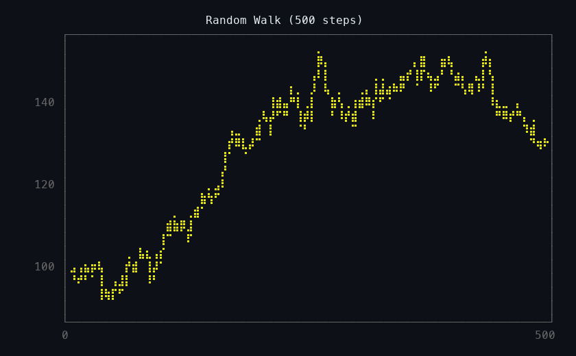
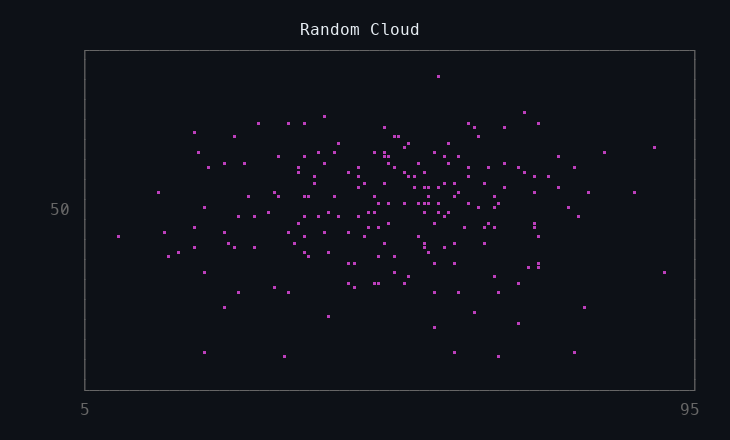
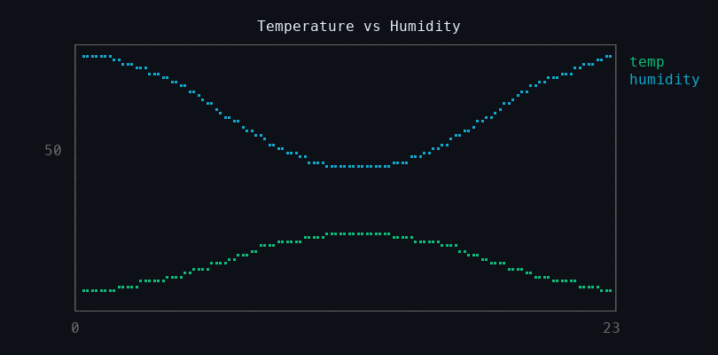
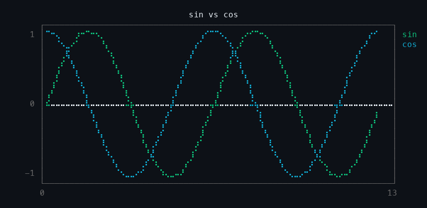
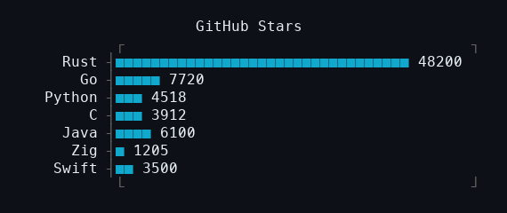
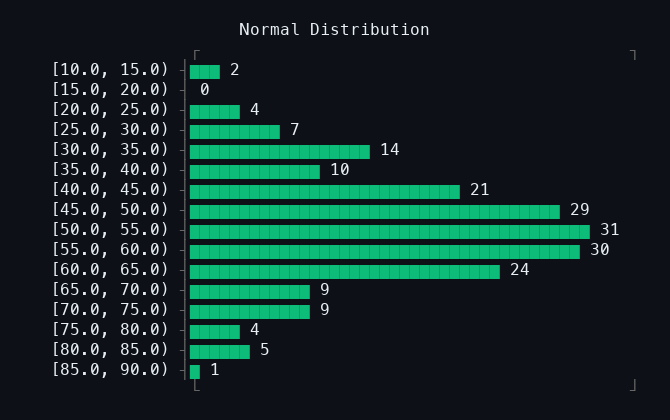
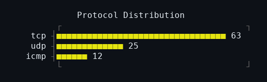

# fu

A brutally fast terminal plotting CLI — a Rust clone of [YouPlot](https://github.com/red-data-tools/YouPlot).

Reads delimited data from stdin or files. Draws charts in the terminal using Unicode braille characters. Aims for call-compatible feature parity with `uplot`, then improvements.

## Gallery

**Sine wave** — 101 data points

```
python3 -c 'import math; [print(f"{i*math.pi/50}\t{math.sin(i*math.pi/50)}") for i in range(101)]' \
| fu line -t "Sine Wave" -w 70 -h 15
```



**Damped oscillation** — 200 data points, exponential decay envelope

```
python3 -c '
import math
for i in range(200):
    t = i * 0.1
    print(f"{t}\t{math.exp(-t * 0.15) * math.sin(t * 2)}")
' | fu line -t "Damped Oscillation" -w 70 -h 17
```



**Random walk** — 500 steps, Gaussian increments

```
python3 -c '
import random; random.seed(42); price = 100.0
for i in range(500):
    price += random.gauss(0, 1.5)
    print(f"{i}\t{price:.2f}")
' | fu line -t "Random Walk (500 steps)" -w 70 -h 20
```



**Scatter plot** — 200 random points, no connecting lines

```
python3 -c '
import random; random.seed(7)
for _ in range(200):
    x = random.gauss(50, 15)
    y = random.gauss(50, 15)
    print(f"{x:.2f}\t{y:.2f}")
' | fu scatter -t "Random Cloud" -w 60 -h 16
```



**Multi-series line chart** — two series with right-side legend

```
python3 -c '
import math
print("hour\ttemp\thumidity")
for h in range(24):
    temp = 20 + 8 * math.sin((h - 6) * math.pi / 12)
    hum = 60 - 15 * math.sin((h - 6) * math.pi / 12)
    print(f"{h}\t{temp:.1f}\t{hum:.1f}")
' | fu lines -H -t "Temperature vs Humidity" -w 60 -h 14
```



**sin vs cos** — multi-series with auto-color and legend

```
python3 -c '
import math
print("x\tsin\tcos")
for i in range(100):
    t = i * math.pi / 25
    print(f"{t:.3f}\t{math.sin(t):.4f}\t{math.cos(t):.4f}")
' | fu lines -H -t "sin vs cos" -w 70 -h 15
```



**Bar chart** — horizontal bars with category labels

```
printf "Rust\t48200\nGo\t7720\nPython\t4518\nC\t3912\n" | fu bar -t "GitHub Stars" -w 50
```



**Histogram** — automatic binning of continuous data

```
python3 -c 'import random; random.seed(42); [print(random.gauss(50, 15)) for _ in range(200)]' \
| fu hist -t "Normal Distribution" -w 60 -n 12
```



**Count** — occurrence counting, sorted by frequency

```
echo -e "tcp\ntcp\nudp\ntcp\nicmp\nudp" | fu count -t "Protocols" -w 45
```



## Why

YouPlot is great but it's Ruby. Every invocation pays ~200ms of startup tax before any data is touched. `fu` does the same job in single-digit milliseconds — even on 100k rows.

| Rows | fu | uplot | Speedup |
|-----:|---:|------:|--------:|
| 10k | 6ms | 180ms | **30x** |
| 100k | 15ms | 521ms | **35x** |

## Install

```
cargo install --path .
```

Or build from source:

```
git clone https://github.com/CryptArtificer/fu
cd fu
make
```

## Usage

```
fu <command> [options] [file]
```

Pipe data in or pass a file:

```
cat data.tsv | fu line -t "preview"
fu line measurements.csv -d,
```

Plots go to stderr by default, so you can insert `fu` mid-pipeline without corrupting data:

```
cat data.tsv | fu line -t "peek" | next_command
```

## Commands

| Command | Aliases | Description |
|---------|---------|-------------|
| `line` | `lineplot`, `l` | Line chart |
| `lines` | `lineplots` | Multi-series line chart |
| `scatter` | `s` | Scatter plot (dots, no lines) |
| `bar` | `barplot` | Horizontal bar chart |
| `hist` | `histogram` | Histogram with auto-binning |
| `count` | `c` | Count occurrences and bar chart |

## Options

```
-d DELIM      field delimiter (default: tab)
-H            input has header row
-T            transpose rows and columns
-t TITLE      title above plot
-w WIDTH      plot width in characters (default: terminal width)
-h HEIGHT     plot height in rows (default: terminal height)
-o [FILE]     output to file or stdout (default: stderr)
-n BINS       number of histogram bins (default: 10)
-m MARGIN     per-side margin: 1, 2, or 4 values (default: 0,0,0,3)
--padding PAD per-side padding: 1, 2, or 4 values (default: 0)
-c COLOR      drawing color (name or 0-255 index)
-C            force color output (even in pipes)
-M            monochrome (no color even on tty)
--grid        draw horizontal grid lines
--xlim MIN,MAX  x-axis range
--ylim MIN,MAX  y-axis range
--xlabel      x-axis label
--ylabel      y-axis label
```

## Showcase

Run all demo scripts:

```
make showcase
```

Individual scripts in `showcase/`:

| Script | Contents |
|--------|----------|
| `01-line-charts.sh` | Sine, damped oscillation, random walk, multi-series, grid + limits |
| `02-scatter.sh` | Random cloud, spiral, multi-series clusters |
| `03-bar-hist-count.sh` | Bar charts, normal + bimodal histograms, word/protocol counting |
| `04-color-and-options.sh` | Named/indexed/auto color, monochrome, axis labels, transpose |

## Roadmap

- [x] Line chart with braille canvas
- [x] Bar chart, histogram, count
- [x] Terminal size auto-detect
- [x] Transpose, axis labels
- [x] Scatter plot
- [x] Multi-series line chart
- [x] ANSI color (16 named + 256 indexed)
- [x] Auto-color palette, legend
- [x] Grid, x/y-axis limits
- [ ] Canvas types (block, ascii, density)
- [ ] Density plot, boxplot
- [ ] Tail mode — live-updating charts from streaming data
- [ ] SVG output mode
- [ ] Full YouPlot CLI compatibility

## License

[MIT](LICENSE)
