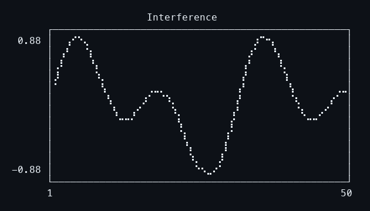

# fu

A brutally fast terminal plotting CLI — a Rust clone of [YouPlot](https://github.com/red-data-tools/YouPlot).

Reads delimited data from stdin or files. Draws charts in the terminal using Unicode braille characters. Aims for call-compatible feature parity with `uplot`, then improvements.

## Gallery

**Sine wave** — 101 data points

```
python3 -c 'import math; [print(f"{i*math.pi/50}\t{math.sin(i*math.pi/50)}") for i in range(101)]' \
| fu line -t "Sine Wave" -w 70 -h 15
```


**Damped oscillation** — 200 data points, exponential decay envelope

```
python3 -c '
import math
for i in range(200):
    t = i * 0.1
    print(f"{t}\t{math.exp(-t * 0.15) * math.sin(t * 2)}")
' | fu line -t "Damped Oscillation" -w 70 -h 17
```


**Random walk** — 500 steps, Gaussian increments

```
python3 -c '
import random; random.seed(42); price = 100.0
for i in range(500):
    price += random.gauss(0, 1.5)
    print(f"{i}\t{price:.2f}")
' | fu line -t "Random Walk (500 steps)" -w 70 -h 20
```


**Interference pattern** — product of sin and cos

```
seq 1 50 | awk '{print $1, sin($1*0.3)*cos($1*0.1)}' OFS="\t" \
| fu line -t "Interference" -w 50 -h 12
```



## Why

YouPlot is great but it's Ruby. Every invocation pays ~200ms of startup tax before any data is touched. `fu` does the same job in single-digit milliseconds — even on 100k rows.

| Rows | fu | uplot | Speedup |
|-----:|---:|------:|--------:|
| 10k | 6ms | 180ms | **30x** |
| 100k | 15ms | 521ms | **35x** |

## Install

```
cargo install --path .
```

Or build from source:

```
git clone https://github.com/CryptArtificer/fu
cd fu
make
```

## Usage

```
fu <command> [options] [file]
```

Pipe data in or pass a file:

```
cat data.tsv | fu line -t "preview"
fu line measurements.csv -d,
```

Plots go to stderr by default, so you can insert `fu` mid-pipeline without corrupting data:

```
cat data.tsv | fu line -t "peek" | next_command
```

## Options

```
-d DELIM    field delimiter (default: tab)
-H          input has header row
-t TITLE    title above plot
-w WIDTH    plot width in characters (default: 40)
-h HEIGHT   plot height in rows (default: 15)
-o [FILE]   output to file or stdout (default: stderr)
```

## Roadmap

- [x] Line chart with braille canvas
- [ ] Bar chart, histogram, count
- [ ] Scatter, density, boxplot
- [ ] Multi-series, color, legend
- [ ] Canvas types (block, ascii, density)
- [ ] Tail mode — live-updating charts from streaming data
- [ ] SVG output mode
- [ ] Full YouPlot CLI compatibility

## License

[MIT](LICENSE)
